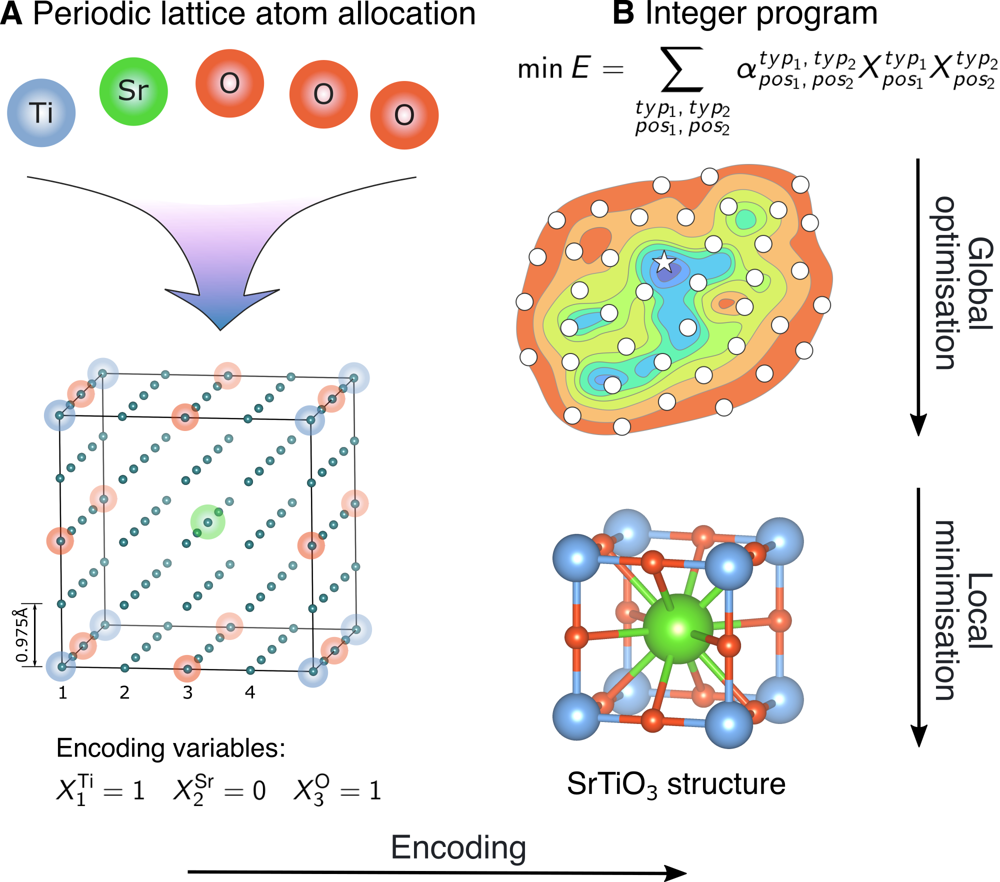

# Integer programming for crystal structure prediction



The task of finding a periodic allocation of atoms on a grid in space that minimises
their pairwise interaction energy can be encoded as an integer program. Such integer program
can be solved either using advanced solvers to obtain provably optimal solutions or 
using quantum annealers (or any other Ising machine) for a potential speed-up or
energy efficiency. Subsequently, solutions of the periodic lattice allocation 
problems can be used to predict crystal structures of materials or perform other 
investigations of the potential energy surfaces.

This package provides implementation of this encoding for uniform grids in
cubic unit cells, where the interaction energy is a sum of periodic Coulombic 
interaction computed using Ewald summation method and Buckingham repulsion. 
An example of interaction potential is provided for Ca-Al-Si-O phase field.
In the current implementation, the resulting integer programs can be solved 
either using Gurobi or D-Wave quantum annealer.

If the package is run as a module, then crystal structure prediction of several well-known 
crystal structures is performed. Solutions of integer programs are reported alongside
the outcomes of subsequent local minimisations and the expected outcomes.


## Installation

### Dependencies

On top of the commonly used python packages, the code relies on:

* [Gurobi][gurobi] to solve integer programs on classical computers (tested with v9.5). Academic licence is available free of charge.
* [D-Wave Leap][leap] and its [SDK][dwave-sdk] to solve quadratic unconstrained binary problems (tested with dwave-ocean-sdk v2.0.1 and v5.0.0). A limited time on a quantum annealer is available each month for free. Classical simulation annealing algorithm is available as well in the same package for testing purposes and requires no registration.  
* [GULP][gulp] for subsequent local minimisations of periodic lattice allocations (tested with 5.2).

[gurobi]: https://www.gurobi.com/
[gulp]: http://gulp.curtin.edu.au/gulp/
[leap]: https://cloud.dwavesys.com/leap/
[dwave-sdk]: https://docs.ocean.dwavesys.com/en/stable/

### Package

It can be installed using pip:
```bash
pip install -e git+git@github.com:lrcfmd/ipcsp.git#egg=ipcsp
```

It will create a local copy of the repository and install the package.
Alternatively, you can clone it as well.

## Usage

The code can be run as a module:

```bash
python -m ipcsp
```

It will perform prediction of a variety of cubic crystal structures. 
The corresponding experimentally determined structures are stored in
`data/structures`. Crystal structure prediction problems to run can be
selected by modifying `test` key in the `settings` dictionary 
defined in `__main__.py` as well as other parameters of the corresponding
lattice allocation problems.

For every phase field, grid and unit cell sizes the package will store 
the interaction values between different pairs of atoms and positions for subsequent use. 
Thus, repeated runs for another space group or composition are usually faster. 

## Citation
This research code is written to accompany the paper "Non-Heuristic Algorithms, Guarantees and Quantum Computing for Crystal Structure Prediction" and this version will not be further updated except for minor corrections.
